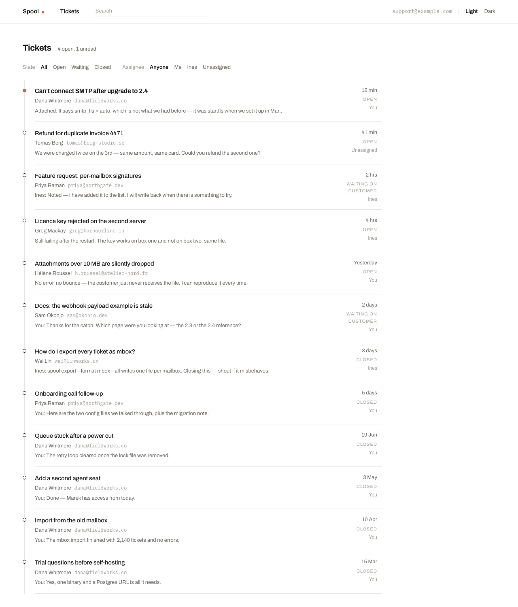
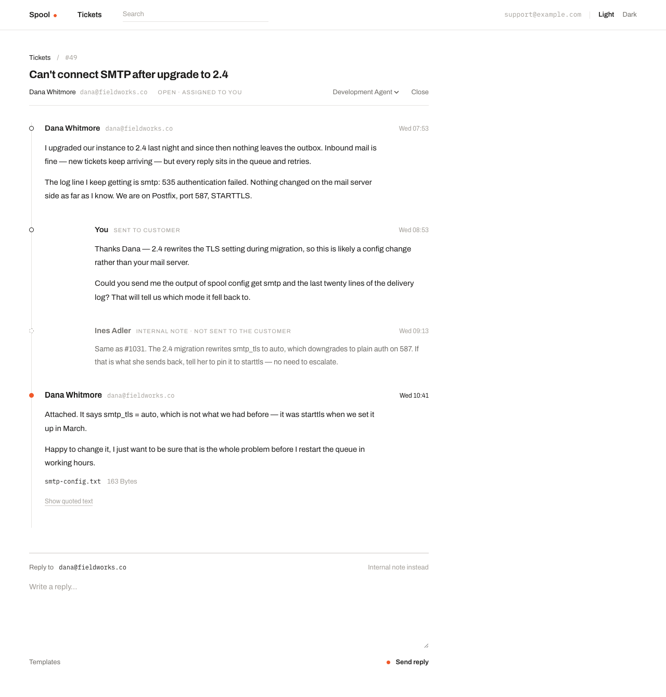
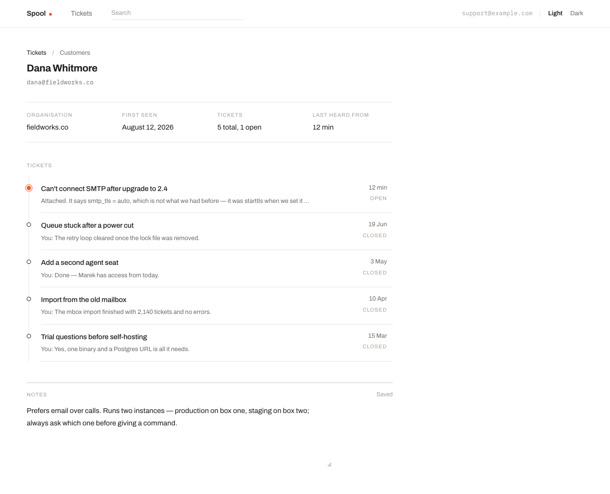
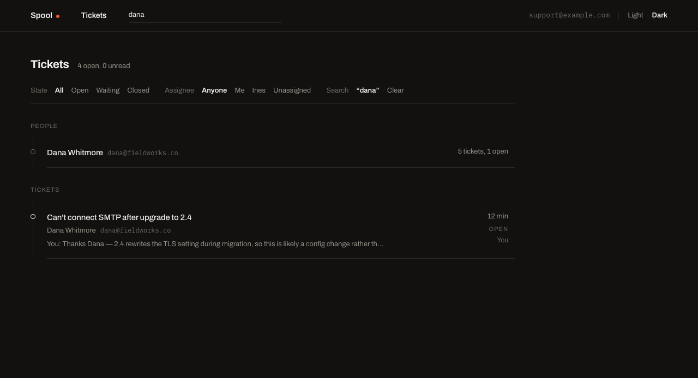

# Spool

A small, self-hosted email helpdesk. Support mail arrives, becomes a ticket, an
agent replies, the thread continues. Built for a team of 1–5.

Named for `/var/spool/mail`, and for the thing you wind thread onto.



## The one constraint

**The primary SQLite file is the entire application state.** Not most of it —
all of it. Messages, attachment bytes, compression dictionaries, sessions.

There is no Active Storage, no blob directory, no second datastore. That is why
attachments live in a table, why there is a zstd layer at all, and why Action
Mailbox was rejected: it stores raw MIME as an Active Storage blob. The payoff
is that backup is one Litestream `dbs:` entry and restore is one file copy,
immediately self-describing — the dictionaries needed to decompress the rows
live in the same file as the rows.

Deliberately absent: Postgres, Redis, Sidekiq, Solid Queue, Active Storage,
Action Mailbox, Action Text, Devise.

The rest of the stack is Rails 8.1 on Ruby 4.0.6, Tailwind and Hotwire with no
SPA and no build step beyond Tailwind's watcher, and
[tuber](https://github.com/tuberq/tuber-rs) — a beanstalkd-compatible queue in
a single Rust binary — for jobs.

## The screens

The ticket list above is home; a ticket and a customer are one click from it.
(Templates, the fourth screen in the design, has a model and no screen yet.)
The design carries structure with alignment and dividers rather than surfaces:
one rule under the header, one accent colour, and nothing else competing for
attention.

**Ticket** — the thread, an internal note beside the customer's mail, quoted
history behind a disclosure, and the composer that replies or takes a note.



**Customer** — who they are, every ticket they have opened, and notes that save
as you type.



**Search** — a `?q=` narrowing of the ticket list rather than a screen of its
own, matching people as well as messages. The whole UI is light or dark; the
theme is one attribute on `<html>` that the browser remembers.



Keyboard, modelled on Basecamp: **hold Shift and the shortcuts are live** —
`⇧J`/`⇧K` walk the list, `⇧L` opens, `⇧H` goes back, `/` focuses search. Hold
Shift for a moment and a legend appears saying what the current screen answers
to; tap it twice to latch the keys unshifted. See [docs/ui.md](docs/ui.md) for
the design tokens, the screen anatomy and why the latch exists.

## Status

Spool is built up to the point where mail has to move. The screens, ingest,
compression, the queue and auth all work; the two ends of the mail path do not
exist yet.

| | |
| --- | --- |
| Ingest — threading, MIME splitting, loop rejection, dedup | done |
| Storage — SQLite, zstd, FTS5, attachments | done |
| Queue — tuber, consumers, scheduler, Active Job adapter | done |
| Auth — OIDC, allowlist, sessions | done |
| UI — ticket list, thread, customer, search | done |
| **IMAP poller** — nothing puts mail *in* yet | not built |
| **Outbound send** — nothing takes mail *out* yet | not built |
| Dictionary training, templates CRUD, pagination | not built |

`Ingest::Inbound.ingest(raw)` is the single entry point for inbound mail, so the
poller is a small piece of work against a settled interface. See
[docs/todo.md](docs/todo.md) for what is next and what was deliberately left
out.

## Running it locally

Ruby 4.0.6 and Docker (which is only used to run tuber; `brew install
tuberq/tuber/tuber` works instead — see `Procfile.dev`).

```bash
bin/setup --skip-server  # bundle, prepare the databases
bin/rails db:seed        # the worked example the screenshots above are taken from
bin/dev                  # web + worker + scheduler + tailwind + tuber
```

Then open http://localhost:3000. With no OIDC provider configured Spool runs
open in development and every request acts as a stand-in agent, so there is
nothing to log in to — see [docs/auth.md](docs/auth.md).

```bash
bin/rails test           # the suite
bin/rails test:system    # headless Chrome
bin/standardrb           # style; --fix to autocorrect
bin/ci                   # everything CI runs
```

Style is [Standard](https://github.com/standardrb/standard). The two per-file
exemptions in `.standard.yml` carry their reasoning inline.

The screenshots in this README are generated, not curated:

```bash
SCREENSHOTS=1 bin/rails test test/system/screenshots_test.rb
```

It loads `db/seeds.rb` into a headless browser and writes `docs/images/`, so
changing the seeds or the design and re-running keeps the README honest.

## Configuration

Everything is environment variables; there is no settings file and no admin
screen.

| Variable | Meaning |
| --- | --- |
| `SPOOL_HOST` | Host authority for absolute URLs — `spool.example.com` or `host:port`, never a URI |
| `SPOOL_MAILBOX` | The support address, shown in the header and used as `From:` |
| `SPOOL_MESSAGE_ID_DOMAIN` | Domain for generated `Message-ID`s; defaults to `SPOOL_HOST`'s domain |
| `OIDC_DISCOVERY_URL`, `OIDC_CLIENT_ID`, `OIDC_CLIENT_SECRET` | The provider. All three or none |
| `OIDC_PROVIDER_NAME`, `OIDC_ISSUER` | Optional: the name on the login button; an issuer override for providers whose discovery URL doesn't imply it |
| `SPOOL_ALLOWED_USERS`, `SPOOL_ALLOWED_DOMAINS` | Who may sign in. Comma-separated; domains match subdomains |
| `TUBER_URL` | The queue, default `localhost:11300` |
| `RAILS_MASTER_KEY` | Rails credentials |

Two combinations are fatal at boot rather than warnings, because both fail in
ways that are hard to diagnose from the outside: **OIDC configured with an empty
allowlist** (every login is denied after a successful round trip to the
provider), and **no provider at all in production** (an unauthenticated
helpdesk serves every customer's correspondence). Every other state is logged
loudly at startup.

## Deployment

One image, three processes, one host. `bin/docker-entrypoint` runs `db:prepare`
only for the web process, so the worker and scheduler can never race it to
migrate.

```
web        ./bin/thrust ./bin/rails server     (the default CMD)
worker     ./bin/worker all                    (or: mail | maintenance)
scheduler  ./bin/scheduler
```

Images are published to `ghcr.io/dkam/spool` by a version bump on `main` —
editing `Spool::VERSION` in `config/version.rb` *is* the release, and the
workflow builds both architectures, moves `:latest`, creates the git tag and
opens the GitHub Release. See [docs/deploy.md](docs/deploy.md).

### With Kamal

`config/deploy.yml` describes the whole deployment: the three roles, the
`spool_storage` volume that holds the SQLite file, the tuber accessory with its
WAL turned on, and the environment above. Fill in the host, the proxy hostname
and your provider, put the secrets where `.kamal/secrets` expects them, then:

```bash
bin/kamal setup      # first time: install docker, boot the proxy, deploy
bin/kamal deploy     # after that
bin/kamal logs -f -r worker
```

### By hand

```bash
bin/build            # builds ghcr.io/dkam/spool:vX.Y.Z locally, with GIT_SHA baked in
```

`GIT_SHA` is what a running container reports as its revision, which is how you
answer "is what I built actually running?" — `docker build .` on its own leaves
it `unknown`. Then run tuber and the three processes against one volume, e.g.

```bash
docker network create spool
docker run -d --name tuber --network spool \
  -e TUBER_BINLOG_DIR=/var/lib/tuber -e TUBER_MAX_STORAGE_BYTES=2g \
  -v tuber_data:/var/lib/tuber ghcr.io/tuberq/tuber:latest server

docker run -d --name spool-web --network spool -p 80:80 \
  --env-file spool.env -v spool_storage:/rails/storage ghcr.io/dkam/spool:latest
docker run -d --name spool-worker --network spool \
  --env-file spool.env -v spool_storage:/rails/storage ghcr.io/dkam/spool:latest bin/worker all
docker run -d --name spool-scheduler --network spool \
  --env-file spool.env -v spool_storage:/rails/storage ghcr.io/dkam/spool:latest bin/scheduler
```

with `TUBER_URL=tuber:11300` in `spool.env`. Tuber's persistence is not
optional in production: the inbound tube carries mail that has been accepted and
not yet turned into a ticket, and an in-memory queue loses it on restart.

`storage/` is the entire backup surface. Only `production.sqlite3` matters —
cache and cable are regenerable.

## Documentation

The [docs](docs/) directory is the design record: it explains *why* the code is
shaped the way it is, and a decision that changes there changes in the same
commit as the code.

Start with [architecture.md](docs/architecture.md) for the constraint everything
else follows from, then [ingest.md](docs/ingest.md) — the email plumbing is
roughly 80% of the difficulty and 20% of the code.
